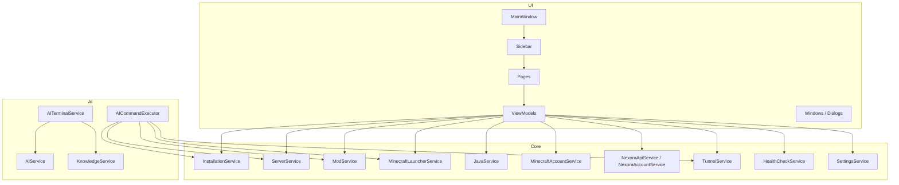

# Architecture Overview

## Overview

MinecraftControlHub is a WPF desktop application built on .NET 8. It follows a strict layered architecture with three primary layers: UI, Core, and AI. All layers are wired together through Microsoft's built-in dependency injection container.

```
┌─────────────────────────────────────────────────────┐
│                    UI Layer (WPF)                    │
│  Pages · ViewModels · Windows · Controls · Styles   │
└───────────────────┬─────────────────────────────────┘
                    │ DI (interfaces only)
┌───────────────────▼─────────────────────────────────┐
│                   Core Layer                         │
│  Services · Models · Interfaces · AppPaths           │
└───────────────────┬─────────────────────────────────┘
                    │
┌───────────────────▼─────────────────────────────────┐
│                    AI Layer                          │
│  AIService · AITerminalService · AICommandExecutor  │
│  KnowledgeService · Knowledge JSON files            │
└─────────────────────────────────────────────────────┘
```

---

## Layer Rules

| Layer | May depend on | May NOT depend on |
|---|---|---|
| UI | Core (interfaces), AI (via ViewModels) | Other UI pages directly |
| Core | Nothing application-specific | UI, AI |
| AI | Core (interfaces via AICommandExecutor) | UI directly |

The AI layer never touches files, processes, or system state directly. It only produces `AICommandBatch` objects. `AICommandExecutor` is the only class allowed to mutate app state.

---

## Key Architectural Patterns

### MVVM
Every page has a corresponding ViewModel. ViewModels hold no UI references — they expose `ObservableCollection<T>`, `RelayCommand`, and properties that bind to XAML. See [MVVM Pattern Implementation](MVVM-Pattern-Implementation).

### Dependency Injection
All services are registered in `App.ConfigureServices()` and resolved through constructor injection. No service locator pattern. See [Dependency Injection & Service Container](Dependency-Injection-and-Service-Container).

### Interface-first design
Every Core service has a corresponding `I` prefixed interface. The UI and AI layers depend only on the interfaces, never the concrete implementations.

### Event-driven UI updates
Services expose C# events (`InstallationsChanged`, `ServersChanged`, `ServerOutputReceived`, `AccountChanged`). ViewModels subscribe to these events and update their `ObservableCollection`s accordingly, without polling.

---

## Component Map



---

## Startup Sequence

1. `App.OnStartup()` builds the DI container via `ConfigureServices()`
2. Theme is applied via `ThemeService.ApplySavedTheme()` before the window renders
3. `MainWindow` is created and shown
4. `MainWindow.OnLoaded()` validates the stored Nexora token
5. If invalid/absent → `NexoraLoginWindow.ShowDialog()`
6. Notification managers start polling (30s interval)
7. Server crash handler is wired: crashes → AI terminal auto-diagnosis

---

## Related Pages

- [System Design & Architecture Patterns](System-Design-and-Architecture-Patterns)
- [Dependency Injection & Service Container](Dependency-Injection-and-Service-Container)
- [MVVM Pattern Implementation](MVVM-Pattern-Implementation)
- [Service Layer Architecture](Service-Layer-Architecture)
- [External API Integration Patterns](External-API-Integration-Patterns)
