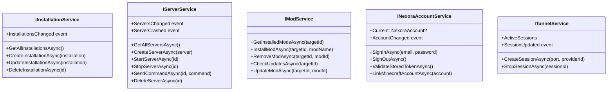

# Core Services

## Overview

The Core layer contains all business logic as injectable services. Every service is defined by an `I`-prefixed interface. The UI and AI layers depend only on these interfaces.

---

## Service Map

---

## All Interfaces

| Interface | Concrete | Lifetime |
|---|---|---|
| `IInstallationService` | `InstallationService` | Singleton |
| `IServerService` | `ServerService` | Singleton |
| `IModService` | `ModService` | Transient |
| `ILoaderService` | `LoaderService` | Transient |
| `IMinecraftLauncherService` | `MinecraftLauncherService` | Transient |
| `IJavaService` | `JavaService` | Transient |
| `IRamCalculatorService` | `RamCalculatorService` | Singleton |
| `IMinecraftAccountService` | `MinecraftAccountService` | Singleton |
| `INexoraAccountService` | `NexoraAccountService` | Singleton |
| `INexoraApiService` | `NexoraApiService` | HttpClient |
| `IInstanceShareService` | `InstanceShareService` | HttpClient |
| `ITunnelShareService` | `TunnelShareService` | HttpClient |
| `ITunnelService` | `TunnelService` | Singleton |
| `IPortScanService` | `PortScanService` | Transient |
| `IInstanceNotificationManager` | `InstanceNotificationManager` | Singleton |
| `ITunnelNotificationManager` | `TunnelNotificationManager` | Singleton |
| `IModrinthApiClient` | `ModrinthApiClient` | HttpClient |
| `IContentService` | `ContentService` | Transient |
| `IModpackExportImportService` | `ModpackExportImportService` | Transient |
| `IServerProvisioningService` | `ServerProvisioningService` | Transient |
| `IHealthCheckService` | `HealthCheckService` | Singleton |
| `ISettingsService` | `SettingsService` | Singleton |
| `IAppLogService` | `AppLogService` | Singleton |

---

## Detailed Pages

- [Installation Management Service](Installation-Management-Service)
- [Server Management Service](Server-Management-Service)
- [Mod Management Service](Mod-Management-Service)
- [Account Management Service](Account-Management-Service)
- [Settings and Configuration Service](Settings-and-Configuration-Service)
- [Utility and Helper Services](Utility-and-Helper-Services)
