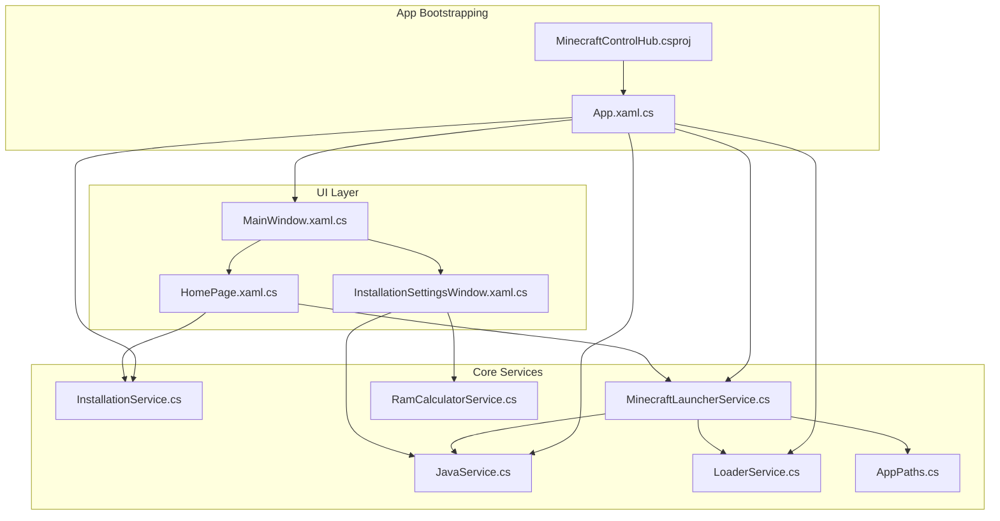
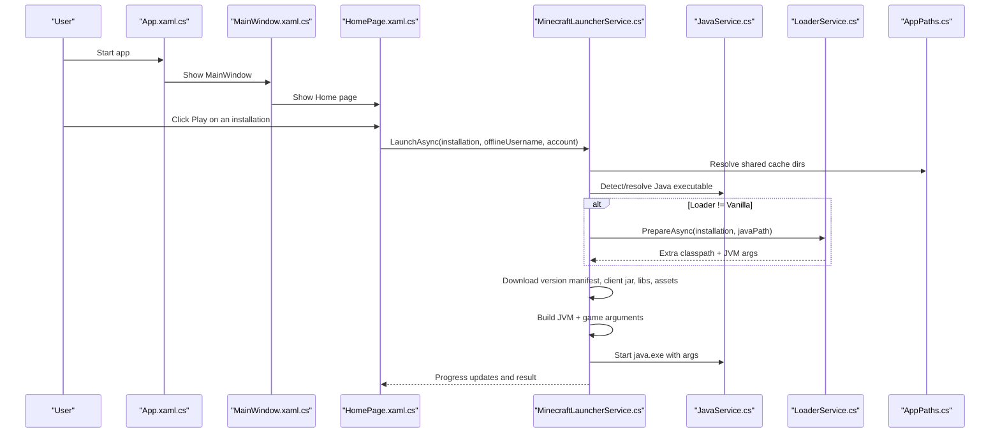
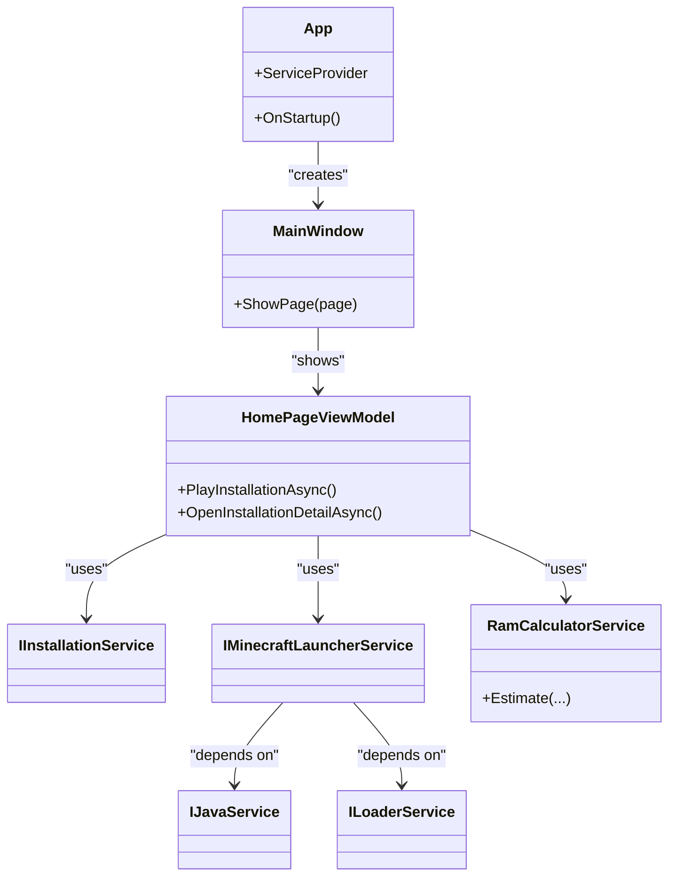

# Getting Started Guide

## Introduction
This guide helps you install and run Minecraft Control Hub on Windows, create your first installation (Vanilla, Fabric, Forge, NeoForge, or Quilt), configure RAM using the built-in calculator, and launch the game for the first time. It also covers basic navigation, common initial tasks, and troubleshooting tips.

## Project Structure
Minecraft Control Hub is a WPF desktop application built with .NET 8 for Windows. The UI layer (WPF pages and ViewModels) depends on a pure Core layer that contains business logic and services. A dependency injection container wires everything together at startup.

## Core Components
- Java detection and management: Automatically detects installed Java versions and can download a compatible JDK if needed.
- Installation lifecycle: Create, import, update, and delete installations; each installation has its own isolated game directory.
- Loader support: Fabric, Quilt, Forge, and NeoForge are supported via metadata APIs and installers.
- Launcher: Resolves version manifests, downloads libraries/assets, builds JVM arguments, and launches the game with live logging.
- RAM calculator: Estimates recommended Min/Max memory based on version, loader, mods, and render distance.
- Paths and storage: Centralized data paths under `%LocalAppData%\MinecraftControlHub`.

## Architecture Overview
At startup, the app configures DI, sets up global error handling, applies theme, and shows the main window. The Home page hosts the installation cards and wizard. When launching, the launcher service resolves versions, downloads assets/libraries, prepares loaders, and starts the Java process with proper arguments and logging.

## Detailed Component Analysis

### Installation Wizard and First-Time Setup
- Open the app and go to the Home page.
- Click "New installation" to open the wizard.
- Choose a Minecraft version from the list (snapshots can be toggled).
- Select a loader: Vanilla, Fabric, Forge, NeoForge, or Quilt.
- Optionally pin a specific loader build or choose "Latest (recommended)".
- The wizard will detect Java requirements and can download a compatible JDK automatically.
- Confirm creation; the app creates an isolated instance folder and lists it on the Home page.

Key behaviors:
- Each installation gets its own game directory under `%LocalAppData%\MinecraftControlHub\instances\<id>`.
- Existing mods from imported profiles are copied into the new isolated folder.

### Java Detection and Management
- On launch, the launcher checks for a suitable Java runtime.
- If none is found or the wrong version is detected, the app suggests installing the correct major version and can download it automatically.
- You can also set a custom Java path per installation in Advanced settings.

What happens under the hood:
- Detects JAVA_HOME and PATH entries.
- Parses version output to determine major version.
- Downloads Eclipse Temurin JDK for the required major version into the app's data folder.

### Creating Installations by Loader Type
- Vanilla: No extra loader steps; uses Mojang's version manifest and assets directly.
- Fabric/Quilt: Lightweight loaders; metadata fetched from their official endpoints; minimal overhead.
- Forge/NeoForge: Uses official installers to prepare the environment; special handling for NeoForge legacy artifacts on certain versions.

Notes:
- Loader-specific libraries and JVM arguments are prepared and merged correctly.
- Classpath de-duplication avoids duplicate jars and module conflicts.

### Configuring RAM with the RAM Calculator
- In the installation details, open the Advanced tab.
- Use the RAM calculator to get recommended Min/Max values based on:
  - Minecraft version base footprint
  - Loader overhead
  - Number and size of mods
  - Render distance setting
- Apply the suggested values to the installation.

Why this matters:
- Newer versions and mod-heavy setups require more memory.
- The calculator adds headroom and rounds to clean numbers for stability.

### Launching Your First Game
- From the Home page, click Play on your installation.
- The launcher:
  - Resolves the version manifest and downloads the client jar, libraries, and assets if missing.
  - Prepares loader-specific files and arguments (if applicable).
  - Starts the Java process with proper JVM flags and redirects output to a live log file.
- After launch, you can view logs for diagnostics.

### Basic Navigation and Initial Tasks
- Sidebar navigation: Home, Accounts, Servers, Mods, Friends, Tunnel, AI, Settings.
- Home page: Manage installations, sign in for online play, share instances.
- Installation details: Mods, ResourcePacks, ShaderPacks, Maps, Screenshots, Advanced.
- Quick actions:
  - Import existing Prism Launcher instances or Modrinth packs.
  - Browse and install content via the integrated browser.
  - Export installations to .mrpack or Prism-compatible zip.

## Dependency Analysis

## Performance Considerations
- Use the RAM calculator to avoid over- or under-provisioning memory.
- Keep render distance near default unless you need higher visibility.
- Prefer pinned loader versions when stability is critical.
- Ensure a modern LTS Java version matching the Minecraft version requirement.

## Troubleshooting Guide
Common issues and resolutions:
- Java not found or wrong version:
  - Let the app download the recommended JDK or set a custom Java path in Advanced settings.
  - Verify JAVA_HOME and PATH include a valid java.exe.
- Immediate crash after launch:
  - Check the latest launch log for the installation under `%LocalAppData%\MinecraftControlHub\logs`.
  - Look for module/classpath errors; ensure loader version matches the Minecraft version.
- Forge/NeoForge startup failures:
  - Ensure the correct loader installer was used and that classpath de-duplication did not drop required jars.
  - For NeoForge on older versions, verify legacy artifact selection.
- Assets/libraries not downloading:
  - Confirm internet connectivity and firewall rules allow HTTPS to Mojang/Modrinth/Adoptium endpoints.
- Import/export issues:
  - Use the provided import options for Prism Launcher instances or Modrinth packs.
  - Export to .mrpack or Prism-compatible zip for compatibility.

Where to find logs:
- Per-installation latest log: `%LocalAppData%\MinecraftControlHub\logs\<installation>-latest.log`
- App diagnostics: `%LocalAppData%\MinecraftControlHub\logs\diagnostics.log`

## Conclusion
You now have the essentials to install Minecraft Control Hub, create your first installation across multiple loaders, configure memory, and launch the game confidently. Use the built-in tools for imports/exports, content browsing, and diagnostics to keep your setup smooth and maintainable.

## Appendices

### Installation Requirements and Setup
- Operating system: Windows
- Runtime: .NET 8 SDK
- Java: One or more JRE/JDK versions (the app can auto-download a compatible one)

Build/run locally:
- Open a terminal in the project directory and run the standard dotnet commands to build and run the app.

### Data Locations
- Application data root: `%LocalAppData%\MinecraftControlHub`
- Shared Minecraft cache: `%LocalAppData%\MinecraftControlHub\minecraft`
- Per-installation folders: `%LocalAppData%\MinecraftControlHub\instances\<id>`
- Logs: `%LocalAppData%\MinecraftControlHub\logs`
