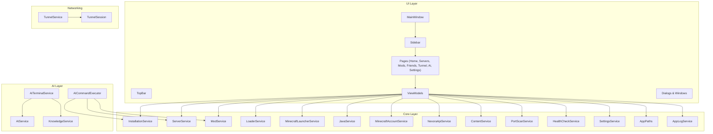
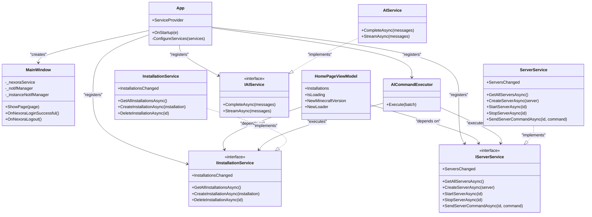
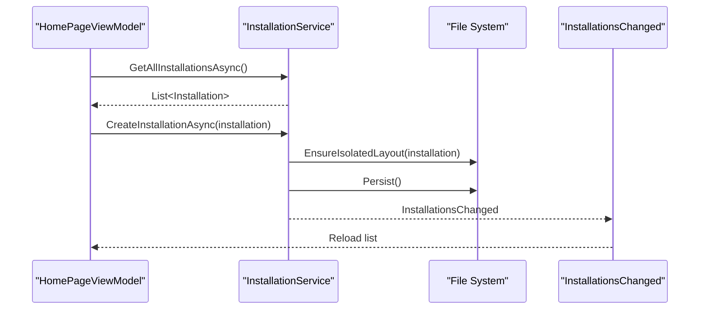
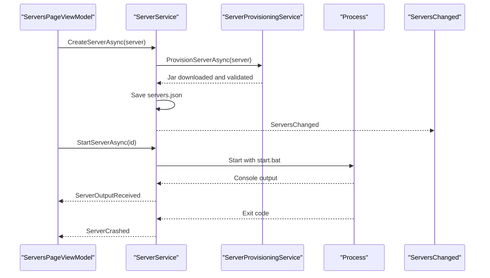
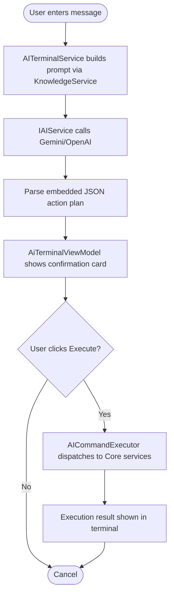
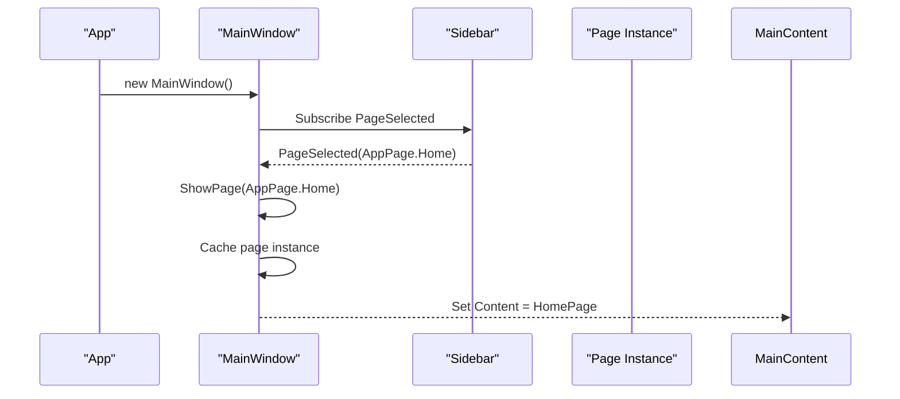
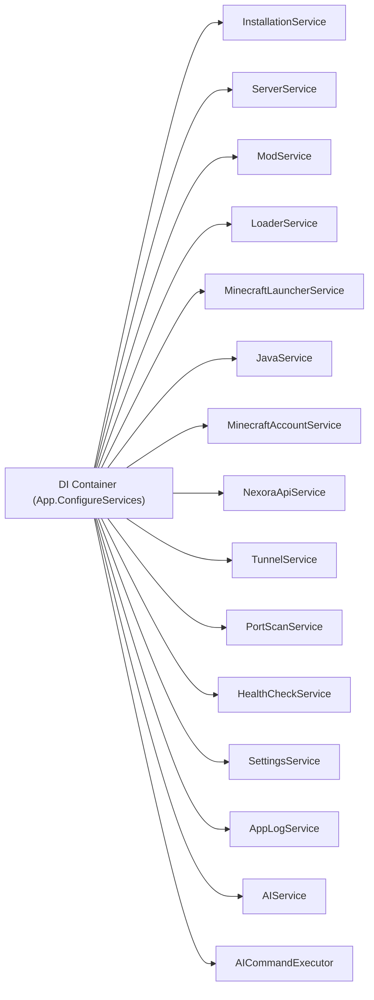

# Project Overview

## Introduction
Minecraft Control Hub is a modular, all-in-one desktop control center for Minecraft management on Windows. It combines launcher and installation management, server administration, mod and modpack browsing (with Modrinth integration), account management (Microsoft/Xbox Live authentication), friend system and sharing via the Nexora platform, tunneling to expose local servers publicly, and an AI command layer that lets you operate the app using natural language. The application is built with WPF on .NET 8 and enforces strict separation between Core (business logic) and UI layers, wired together through dependency injection.

Key capabilities include:
- Multi-version installation management across Vanilla, Fabric, Forge, NeoForge, and Quilt
- Real-time server administration with live console output and process lifecycle control
- Modrinth-powered mod and modpack browser with import/export to Prism Launcher-compatible formats
- Microsoft/Xbox Live device-code authentication flow
- Nexora platform integration for friends, notifications, and instance/tunnel sharing
- Tunnel providers (ngrok, bore, serveo, frp, playit.gg) with automatic discovery and one-click sharing
- AI terminal that translates natural language into safe, user-confirmed actions executed by Core services

Target audience includes players who want a unified tool to manage multiple installations and servers, content creators distributing modpacks, and users who prefer conversational control over repetitive tasks.

System requirements:
- Windows operating system
- .NET 8 SDK for building; runtime sufficient for running the app
- Internet access for Modrinth API, Minecraft manifests, and optional AI provider

High-level component relationships:
- UI (WPF Pages/ViewModels/Windows) depends on Core Services via DI
- Core Services encapsulate business logic and external integrations (Modrinth, Mojang, Nexora, Java, tunnels)
- AI layer provides a conversation interface that produces structured commands executed by Core services only after explicit user confirmation

## Project Structure
The solution follows a layered architecture:
- UI: WPF pages, view models, windows, styles, and helpers
- Core: Business logic services and domain models, no WPF dependencies
- AI: Natural-language assistant layer with knowledge files and executor
- Networking: Tunnel session and service abstractions
- Styles: Shared XAML themes and controls

## Core Components

**Installation management**
- InstallationService: CRUD for client installations, isolated game directories per installation, migration from shared .minecraft, import from official launcher profiles, events for UI refresh
- LoaderService: Fetches available loader versions from Maven/meta APIs
- MinecraftLauncherService: Launches Minecraft with correct JVM args and Java detection
- JavaService: Detects installed runtimes and recommends versions per Minecraft version
- RamCalculatorService: Recommends Min/Max memory based on version, loader, mods, render distance

**Server administration**
- ServerService: Full lifecycle (create, start, stop, delete), background provisioning, process management, console streaming, crash events
- ServerProvisioningService: Downloads server jars for Vanilla, Paper/Purpur, Fabric/Quilt, Forge/NeoForge; validates artifacts; supports run.bat-based startup

**Mods and content**
- ModService: Install/uninstall mods per installation or server, dependency resolution, update checks
- ModrinthApiClient: REST client for search, versions, downloads
- ModpackExportImportService: Export/import to Prism Launcher-compatible .mrpack manifests
- ContentService: Lists resource packs, shader packs, worlds in a game directory

**Accounts and platform integration**
- MinecraftAccountService: Microsoft device-code OAuth flow, token storage and refresh
- NexoraAccountService/NexoraApiService: Login, validation, link/unlink, friends, notifications, sharing endpoints

**Tunnels and networking**
- TunnelProviderRegistry/TunnelShareService/TunnelNotificationManager: Provider descriptors, sharing with friends, polling notifications
- PortScanService: Scans local ports to find available ones for new servers
- TunnelService/TunnelSession: Generic tunnel session abstraction and provider execution

**Infrastructure**
- SettingsService: Persisted settings (AI provider/model/key, offline username, tunnel exe paths, feature toggles)
- AppPaths: Central registry of file system paths
- AppLogService: Append-only diagnostics log
- HealthCheckService: Aggregates health signals (Java, RAM usage, updates, crashes)

## Architecture Overview

## Detailed Component Analysis

### Installation Management
InstallationService manages multi-version client installations with isolated directories, migration support, and import from the official launcher profiles. It persists metadata to JSON and raises change events so UI can reload without polling.

### Server Administration
ServerService orchestrates server lifecycle, including provisioning, process management, console streaming, and crash handling. It integrates with ServerProvisioningService to download and validate server artifacts.

### AI Command Layer
The AI layer converts natural language into structured commands, which are then executed by Core services after explicit user confirmation.

### UI Navigation and State
MainWindow caches page instances to preserve state during navigation and wires up notification managers when logged into Nexora.

## Dependency Analysis

## Performance Considerations
- Use singleton services for shared state (e.g., accounts, settings, logging) to avoid redundant initialization
- Prefer async operations for network calls (Modrinth, Nexora, AI) and long-running tasks (provisioning, downloads)
- Stream AI responses to improve perceived responsiveness
- Avoid blocking UI thread; use Dispatcher.InvokeAsync for cross-thread updates
- Reuse HttpClient instances via DI to reduce socket exhaustion
- Monitor RAM usage and adjust JVM flags based on HealthCheckService feedback

## Troubleshooting Guide
Common issues and strategies:
- Unhandled exceptions: Global handlers log errors and show dialogs instead of crashing silently
- Server crashes: Crash events trigger AI diagnosis prompts in the terminal
- Authentication failures: Validate stored tokens and re-prompt login if invalid
- Mod conflicts: Use dependency checks and auto-fix suggestions in the Mods page
- Tunnel sharing: Verify provider configuration and ensure firewall allows inbound traffic

Operational tips:
- Check diagnostics.log for detailed error traces
- Review server logs and console output for runtime issues
- Validate Java path and version compatibility for target Minecraft versions
- Confirm Modrinth API availability and rate limits when searching/installing mods

## Conclusion
Minecraft Control Hub delivers a comprehensive, modular control center for Minecraft management with clear architectural boundaries and robust integrations. Its DI-driven design enables maintainability and testability, while features like real-time server administration, Modrinth integration, Nexora platform connectivity, and AI-assisted commands provide practical value for both casual players and power users. The project's emphasis on safety (user-confirmed AI actions), clarity (health checks), and interoperability (.mrpack import/export) positions it as a strong foundation for future enhancements such as cloud synchronization and advanced whitelisting.

## Appendices

### System Requirements
- Windows OS
- .NET 8 runtime (for running); .NET 8 SDK (for building)
- Internet access for Modrinth, Mojang, Nexora, and optional AI provider

### Practical Use Cases
- Multi-installation setup: Create separate Fabric and Forge installations for different modpacks, each with tailored JVM arguments and Java versions
- Server hosting: Provision a Paper server, configure properties, start it, and share its public address via tunnel with friends
- Mod management: Search Modrinth for mods, install with dependency resolution, and export the pack to distribute to others
- Conversational control: Ask the AI terminal to create a server or install a mod, review the proposed actions, and execute them safely
